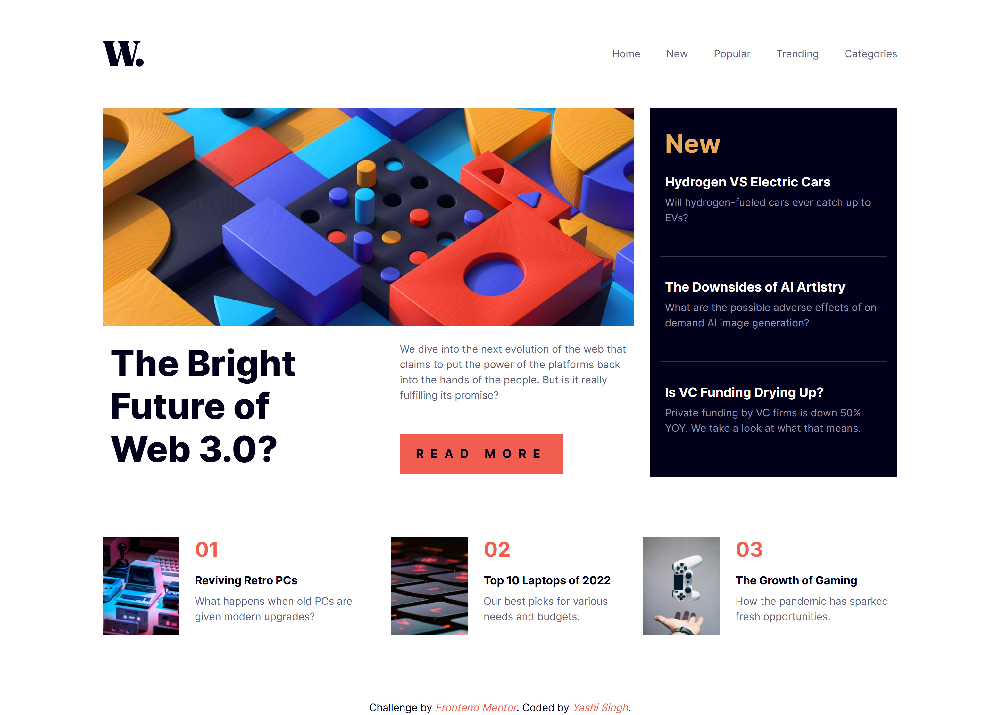
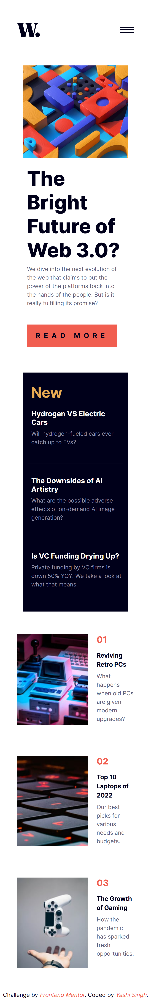

# Frontend Mentor - News Homepage Solution

This is a solution to the [News homepage challenge on Frontend Mentor](https://www.frontendmentor.io/challenges/news-homepage-H6SWTa1MFl). This project showcases a responsive and interactive news homepage that adapts to various screen sizes.  

## Table of Contents

- [Overview](#overview)
  - [The Challenge](#the-challenge)
  - [Screenshots](#screenshots)
  - [Links](#links)
- [My Process](#my-process)
  - [Built With](#built-with)
  - [What I Learned](#what-i-learned)
  - [Continued Development](#continued-development)
  - [Useful Resources](#useful-resources)
- [Getting Started](#getting-started)
  - [Installation](#installation)
  - [Running the Project](#running-the-project)
- [Author](#author)
- [Acknowledgments](#acknowledgments)

---

## Overview

### The Challenge

Users should be able to:

- View the optimal layout for the interface depending on their device's screen size.
- See hover and focus states for all interactive elements on the page.
- Toggle the mobile menu on smaller devices.

### Screenshots

#### Desktop View:

  

#### Mobile View:

 

### Links

- **Solution URL:** [Frontend Mentor Solution](https://www.frontendmentor.io/solutions/news-homepage-_wHsEUurWK)  
- **Live Site URL:** [Live Demo](https://yashi-singh-9.github.io/News-Homepage/)

---

## My Process

### Built With

- **HTML5** for semantic structure.
- **LESS** for CSS pre-processing.
- **Bootstrap 5** for responsive layout and styling utilities.
- **Vanilla JavaScript** for interactive elements like the mobile menu toggle.
- **Mobile-first workflow** to ensure responsiveness across devices.

### What I Learned

During this project, I reinforced my understanding of responsive design and gained hands-on experience with LESS, Bootstrap, and media queries.  
Below are some highlights of the code:  

#### LESS Variable Usage:
```less
@soft-orange: hsl(35, 77%, 62%);
@very-dark-blue: hsl(240, 100%, 5%);
```

#### Media Query for Mobile Layout:
```less
@media (max-width: 890px) {
  ul.mobile {
    display: flex;
    flex-direction: column;
    gap: 1rem;
    position: absolute;
    top: 8rem;
  }
}
```

#### JavaScript for Menu Toggle:
```javascript
menuToggle.addEventListener('click', () => {
  mobileMenu.classList.toggle('active');
  menuToggle.setAttribute('src', mobileMenu.classList.contains('active') 
    ? 'assets/images/icon-menu-close.svg' 
    : 'assets/images/icon-menu.svg');
});
```

### Continued Development

In future projects, I aim to:
- Enhance animation techniques for interactive UI elements.
- Explore more CSS pre-processors like SCSS.
- Further improve my understanding of JavaScript frameworks such as React or Vue.js.

### Useful Resources

- [LESS Documentation](https://lesscss.org/) - Helped me understand LESS syntax and variables.  
- [Bootstrap Documentation](https://getbootstrap.com/docs/5.3/getting-started/introduction/) - Provided styling utilities and layout techniques.  
- [CSS-Tricks: Media Queries](https://css-tricks.com/snippets/css/media-queries-for-standard-devices/) - A great guide for writing responsive layouts.  

---

## Getting Started

### Installation

To run this project locally, follow these steps:  

1. **Clone the repository:**  
   ```bash
   git clone https://github.com/Yashi-Singh-9/News-Homepage.git
   cd News-Homepage
   ```

2. **Install LESS (if not already installed):**  
   ```bash
   npm install -g less
   ```

3. **Compile the LESS file to CSS:**  
   Inside the project directory, run:  
   ```bash
   lessc style.less style.css
   ```

4. **Start a local server (optional):**  
   Use any HTTP server (e.g., Live Server in VS Code).

### Running the Project

1. Open the `index.html` file in your browser.  
2. View and interact with the project to see the layout adapt across various screen sizes.

---

## Author

- **LinkedIn:** [Yashi Singh](https://www.linkedin.com/in/yashi-singh-b4143a246)  
- **Frontend Mentor:** [@yashisingh](https://www.frontendmentor.io/profile/yashisingh)

---

## Acknowledgments

This project was inspired by the **Frontend Mentor** community. Special thanks to the creators of this challenge for providing such an excellent learning opportunity!  
